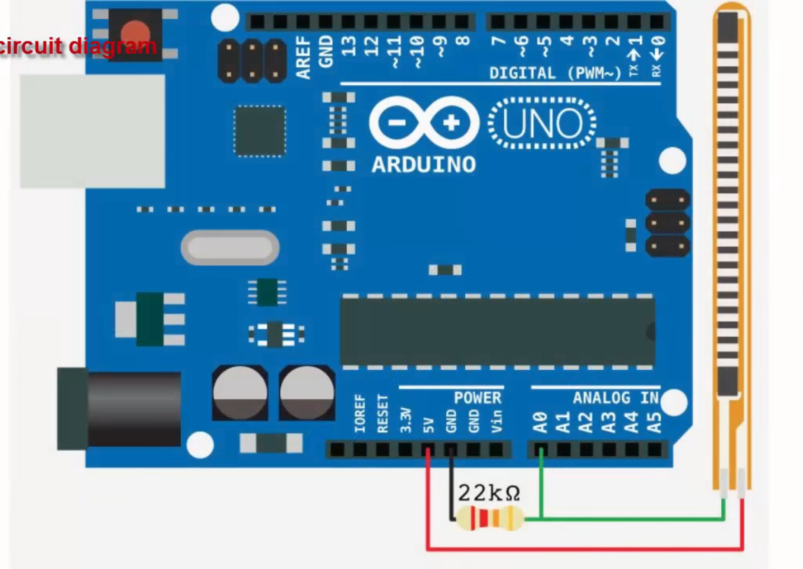

---
title: "Talkative Gloves - Alexa"
author: [José Javier Alonso Ramos]
date: "Curso: 2019 - 2020"
subject: "Markdown"
keywords: [Markdown, Example]
subtitle: "Tecnologías Emergentes"
lang: "es"
titlepage: true
titlepage-rule-height: 1
logo: "/home/jjavier/GII/logoUGR/3.png"
logo-width: 300
toc: TRUE
toc-own-page: TRUE
titlepage-color: e0fbff
titlepage-text-color: 110406
...
# Info

El proyecto explica como convertir unos guantes normales en unos que nos dan la posibilidad de hablar tan solo con gestos de nuestra mano. Cada gesto se traducirá a una palabra o frase que será dicha por un altavoz. Esta implementación se dirige específicamente al uso de Alexa mediante gestos.

# Hardware necesario
- Guantes
- Sensores de flexión
- Raspberry
- Arduino
- Altavoz
- Alexa (para probar su uso - no es indispensable)

# Software necesario

## Librerías
Para poder leer el puerto serie de arduino en raspberry desde un programa en python.
\vskip 2em
```bash
sudo -H pip3 install pyserial
```
Librería que permite pasar texto escrito a voz.
\vskip 2em
```bash
sudo -H pip3 install pyttsx3
```
Programa que usa la librería pyttsx3 para reproducir sonido desde el ordenador o, en nuestro caso, desde la raspberry.
\vskip 2em
```bash
sudo apt-get update && sudo apt-get install espeak
```

# Código
## Arduino
El código de arduino es muy básico. Tan solo tendremos que leer analógicamente los sensores de flexión y decidir cuáles son los dedos que están flexionados según el valor que devuelvan. El umbral a partir del cuál consideramos que están flexionados será arbitrario y, seguramente, diferente para cada dedo.  
Lo que el arduino manda por el puerto serie a la raspberry es un String (una cadena de texto) de 5 dígitos (uno para cada dedo en orden: Pulgar, Ínice, Corazón, Anular y Meñique) siendo el valor 1 si el dedo está flexionado y 0 si no lo está. De esta forma, una cadena de tipo '10111' indicaría que sólo el dedo índice está estirado o '00110' indicaría que estás jugando a ser _Spiderman_.
\vskip 2em
```c++
String mensaje = '';

int pulgar = analogRead(Pulgar);
if(pulgar < umbralPulgar)
    mensaje += '1';
else
    mensaje += '0';

int indice = analogRead(Indice);
if(indice < umbralIndice)
    mensaje += '1';
else
    mensaje += '0';

int corazon = analogRead(Corazon);
if(corazon < umbralCorazon)
    mensaje += '1';
else
    mensaje += '0';

int anular = analogRead(Anular);
if(anular < umbralAnular)
    mensaje += '1';
else
    mensaje += '0';

int menique = analogRead(Menique);
if(menique < umbralMenique)
    mensaje += '1';
else
    mensaje += '0';

Serial.println(mensaje);
```

## Raspberry
Este código también es muy sencillo pero como usa bibliotecas no muy habituales lo vamos a repasar un poco. Lo puedes ver completo [**aqui**](https://github.com/JJavier98/TE-Vestible/blob/master/guante.py).  

Lo primero que hacemos es inicializar el proceso de _Test to Speech_ e indicar que la voz que vamos a usar en este caso es en _español_:  
\vskip 2em
```python
engine = pyttsx3.init()
engine.setProperty('voice', 'spanish')
```

Para poder ver todos los tipos de voces de las que dispone esta biblioteca podemos hacer lo siguiente:  
\vskip 2em
```python
voces = engine.getProperty('voices')
for i in range(len(voces)):
    println('Voz: ', voces[i].id)
```

Ahora creamos una variable para leer el puerto serie al que se conecta el arduino. ___ttyACM0___ se trata del puerto serie por el que leemos los datos (puede que en tu raspberry sea otro), la **velocidad de comunicación** es a tu elección pero 115200 baudios es el valor que mejores resultados me ha dado y establecemos un tiempo de ___timeout___ de 3 segundos. Si tras este tiempo no hemos conseguido estableer conexión nos dará un error:
\vskip 2em
```python
arduino = serial.Serial('/dev/ttyACM0', baudrate=115200, timeout=3.0)
```

Y por último leemos los datos que nos envía el arduino con la sentencia ___readline___ y hacemos un casting a String. La segunda línea formatea el texto de entrada para solo quedarnos con los 5 dígitos que nos interesan:
\vskip 2em
```python
val = str(arduino.readline())
val = val[2:7]
```

Con esto hecho solo nos queda establecer distintas frases o palabras que queremos decir cuando se de cierta combinación.  
\vskip 2em
```python
# Si flexionamos solo pulgar
if val == '10000':
    engine.say('Hola')
# Si flexionamos solo índice
elif val == '01000':
    engine.say('Adiós')
# Si flexionamos solo corazón
elif val == '00100':
    engine.say('Soy un guante que habla')
...
...
# Si flexionamos índice, corazón y meñique
elif val == '01101':
    engine.say('Tengo hambre')
...

# Ejecutamos el TTS
engine.runAndWait()
```
Como hemos dicho antes, este ejemplo en concreto se hizo para comunicarse con el asistente de Amazon, Alexa. Por eso la única sentencia que lee el código de ejemplo en un principio es _'11111'_ (puño cerrado). Esta sentencia reproduce la palabra _'Alexa'_, lo que invoca al asistente y sólo después de hacer esto el programa es capaz de leer más combinaciones para darle órdenes.

# Construcción

## Sensores
Como los sensores de flexión pueden resultar caros para un proyecto casero y más si queremos utilizar todos los dedos de la mano o incluso las dos manos vamos a ver como fabricar los nuestros propios.

### Materiales
- Papel
- Papel de aluminio
- Lápiz o carboncillo
- Cables

### Preparación
Tendremos un sensor para cada dedo. Cortamos un trozo de papel del ancho del dedo donde vaya a ir el sensor y de longitud el doble. Lo doblamos por la mitad longitudinalmente y una mitad la coloreamos entera con el lápiz sin dejar ningún hueco en blanco y apretando lo suficiente como para dejar bastante carboncillo en ella. En la otra mitad pondremos dos tiras de papel de aluminio de manera longitudinal y sin que se toquen. Al extremo de estas dos tiras conectaremos dos cables que serán los que conectemos con el arduino.  
  

La conexión a arduino se realiza de la siguiente manera (da igual qué cable consideremos positivo o negativo):  
  

## Guante
Una vez listos los sensores solo queda introducirlos en el guante. Para un mejor funcionamiento es recomendable situarlos sobre los dedos y no debajo. Podemos coserlos o pegarlos al interior del guante pero asegúrate de que no se quedan muy rígidos y siguen siendo maleables.  
  

Y este sería el aspecto del guante acabado. Como vemos no se notan para nada los sensores flexibles. Si trabajamos un poco más en la ocultación de los cables y la disposición del arduino y la raspberry podríamos tener un sistema vestible que pase totalmente desapercibido.  

{width=500px}  